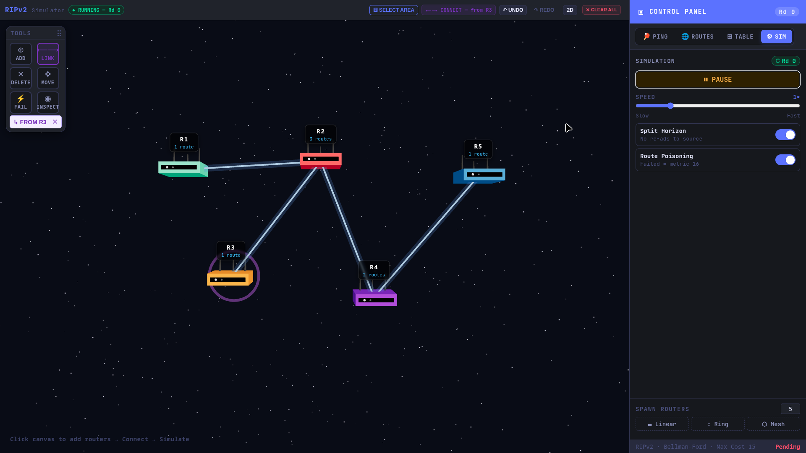
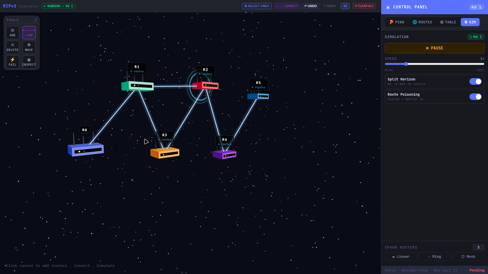
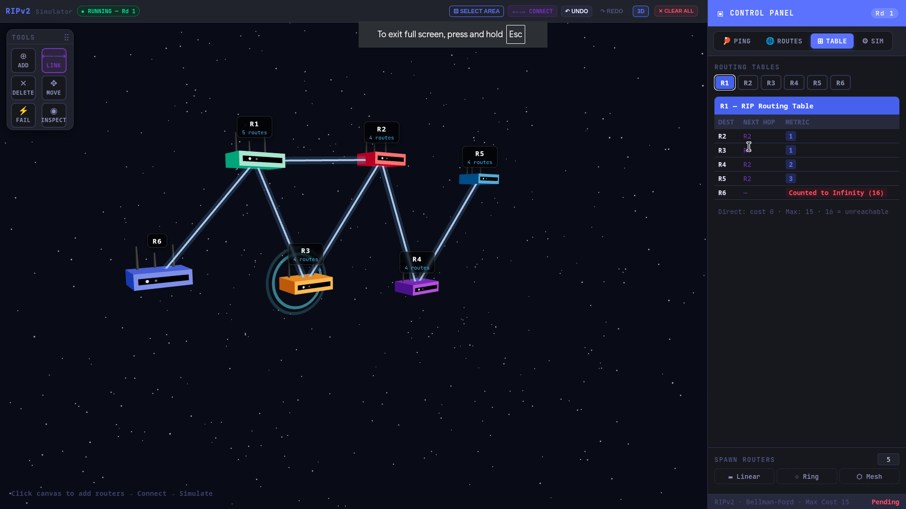

# 🌐 RIPSim: Interactive RIP Routing Simulator

> *An immersive, real-time visualization platform for exploring the Routing Information Protocol (RIP) in 2D and 3D environments.*

## 📖 Project Overview

**RIPSim** is a powerful, interactive network simulator built with React and Three.js, specifically designed to bring the **Routing Information Protocol (RIP)** to life. It allows users to intuitively design custom network topologies by placing routers and establishing links. 

The simulator demonstrates the **Distance-Vector (Bellman-Ford)** algorithm in real-time, visualizing how routers discover paths, calculate hop counts, and adapt to network changes or link failures. With its unique **3D Globe View**, RIPSim transforms abstract networking logic into a tangible, geometric experience.

---

## 📸 Gallery

*Add your project screenshots here to showcase the simulator in action.*

### 2D Topology Editor

*Design and manage network nodes on a precise grid.*

### 3D Globe Visualization

*Project and interact with your network on a spatial 3D sphere.*

### Routing Tables & Convergence

*Monitor real-time RIP routing updates and network stability.*

---

## 💡 Key Technologies

RIPSim leverages a modern, high-performance tech stack:
- **React**: Powering the dynamic UI and simulation state management.
- **Vite**: Ensuring a lightning-fast development and build pipeline.
- **Three.js & React Three Fiber**: Driving the immersive 3D network visualization.
- **TailwindCSS**: For a clean, modular, and responsive interface design.

---

## ✨ Features

- **🧠 Authentic RIP Implementation**
  - **Bellman-Ford Algorithm**: Routers periodically exchange routing updates with immediate neighbors.
  - **15-Hop Limit**: Accurately enforces the standard RIP maximum metric (16 = Unreachable).
  - **Loop Prevention**: Models mechanisms like Split Horizon and Poison Reverse to maintain network stability.

- **📊 Visualization Modes**
  - **2D Topology Editor**: Design and manage network nodes on a precise grid.
  - **3D Globe View**: Project and interact with your network on a spatial 3D sphere.
  
- **⏯️ Simulation Logic**
  - **Real-time Convergence**: Watch routing tables propagate until stability is reached.
  - **Interactive Links**: Toggle link failures on the fly to observe immediate RIP route recalculations.


---

## 🏗 Technical Architecture

RIPSim is architected for performance and clarity:

- **Simulation Core**: The RIP logic and graph traversal are handled within the React state, ensuring high responsiveness during interactive sessions.
- **Rendering Layer**: Utilizes WebGL (via Three.js) for hardware-accelerated 3D rendering of network nodes and paths.
- **Frontend-First Design**: A clean separation between the mathematical routing engine and the visual rendering layers.

---

## ⚙️ How It Works

1. **Topology Creation**: Users place routers on the 2D canvas or 3D sphere.
2. **Dynamic Linking**: Routers are connected via links. Each link represents a hop.
3. **Route Discovery**: Upon starting the simulation, routers exchange their distance vectors. 
4. **Convergence**: The system updates until all routers possess the shortest-path information for the entire network.
5. **Fault Injection**: Break a link and watch the RIP protocol detect the failure and reroute traffic based on updated hop counts.

---

## 💻 Run Locally

To run RIPSim on your local machine, follow these steps:

### Prerequisites
- **Node.js**: v16.x or higher
- **npm**: (Included with Node.js)

### 1. Clone the Repository
```bash
git clone https://github.com/donigurram/Routing-Information-Protocol-CN-.git RIPSim
cd RIPSim
```

### 2. Install Dependencies
Navigate to the frontend directory and install the required packages.
```bash
cd frontend
npm install
```

### 3. Start the Development Server
This will start the Vite dev server.
```bash
npm run dev
```

---

## Team Members

- Doni Gurram - 2024BCS-026
- Nambi Madhav - 2024BCS-041
- Pendem Yashwanth Kumar - 2024BCS-046
- Vancha Manisharan Reddy - 2024BCS-080

*If you find this simulator helpful for learning or teaching networking protocols, consider giving it a ⭐!*